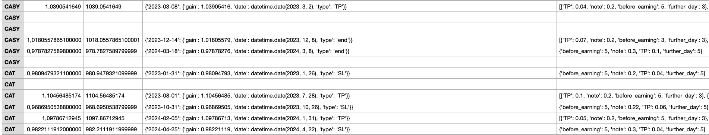

# Backtesting d'actions basé sur des données de trading et des actualités

## Description
Ce projet implémente un système de backtesting pour évaluer des stratégies de trading sur des actions en utilisant les données financières, les EMA (Exponential Moving Averages) et les actualités. Il intègre également l'API Alpha Vantage pour récupérer des données manquantes ou complémentaires.
La stratégie consiste en l'évaluation des sentiments des investisseurs en amont des sorties de résultats trimestriels avec des positions longues en amont des communiqués de presse.
La stratégie s'établit en deux temps: 
- un premier dans laquelle elle teste pour chaque action une multitude de combinaisons de paramètres (note minimale, période plus en moins longue d'entrée et sortie potentielles, stoploss et takeprofits)
- un second dans laquelle on récupère manuellement les combinaisons les plus rentables sur ces premiers résultats pour chaque action, en cherchant à identifier des patterns entre les différents trimestres. Si on remarque une combinaison bénéficiaire à un semestre, on teste cette combinaison pour le semestre suivant.


De nombreuses stratégies ont pu être testées sur environ 700 actions, sur 6 résultats trimestriels récents. Cette méthode en deux temps est la dernière en date, l'objectif initial avait pour volonté de repéré un pattern initial (un paramétrage gagnant) qui permettait d'imaginer un trading algorithmique de très court terme (swing trading) avec des résultats majoritairement gagnants afin de chercher à combiner un grand nombre de trades capitalisant les uns sur les autres.

Une des grosses limites, ayant poussé à l'abandon du projet, correspond au temps d'attente (des heures pour quelques dizaines d'actions, malgré le téléchargement local des données) pour chaque simulation du fait des nombreuses combinaisons de paramètres à simuler. 

Le processus principal consiste à :
- Extraire des données financières et des actualités.
- Tester différents paramétrages sur une même stratégie en simulant des trades sur un historique. 
- Identifier les meilleurs paramètres pour optimiser les rendements.

## Fonctionnalités
- **Backtesting** : Simule des stratégies de trading basées sur des critères prédéfinis.
- **Analyse des EMA** : Utilisation des EMA pour définir des zones de trading.
- **Utilisation des actualités** : Analyse du score de sentiment des nouvelles pour influencer les décisions.
- **Optimisation des paramètres** : Recherche des meilleurs paramètres pour maximiser le rendement.
- **Gestion des données** : Téléchargement automatique des données manquantes via l'API Alpha Vantage.

---

## Structure du projet

### 1. **`main.py`**
Gère le processus principal de l'extraction des données et du lancement des simulations.

#### Exemple d'exécution :
```python
import asyncio
from backtestF import extraction

async def main():
    earnings = [1, 2, 3, 4, 5, 6] #
    univers = ['AAON', 'AAPL', 'DEI', 'DIS', 'DK', ...]  # Liste de tickers
    filename = 'resultats.csv'

    for action in univers:
        for earning in earnings:
            try:
                await extraction(filename, earning, action, combinaison=None)
            except ValueError as e:
                print(f"Erreur pour l'action {action}: {e}")
                continue
asyncio.run(main())
```

### 2. **`backtest.py`**
Implémente le cœur du backtesting, calculant les rendements, la gestion des positions, et l'analyse des résultats.

Fonctions principales :
analysis(daily_results) : Analyse les résultats quotidiens pour générer un rapport global.

main_backtest(symbol, earnings, before_earning, minimal_note, TP, further_day, backtest) : Simule les trades sur une période donnée en fonction des paramètres.

### 3. **` outputF.py`**
Définit les fonctions liées à l'exécution des trades journaliers.

Fonctions principales :
commission(total, units) : Calcule les commissions.
daily_trade(raw_data, last_infos, current_date, minimal_note, TP, further_day) : Simule l'exécution d'un trade quotidien basé sur les conditions définies.

### 4. **`local_dataF.py`**
Gère les données locales et leur récupération via l'API Alpha Vantage.

Fonctions principales :
news_recovery(day_news, symbol, start_date) : Récupère les actualités liées à un ticker pour une date donnée.
ohlc_recovery(symbol, start_date, end_date) : Récupère les données OHLC pour une période donnée.
telecharger_donnees_alpha_vantage : Télécharge les données financières à partir d'Alpha Vantage.
